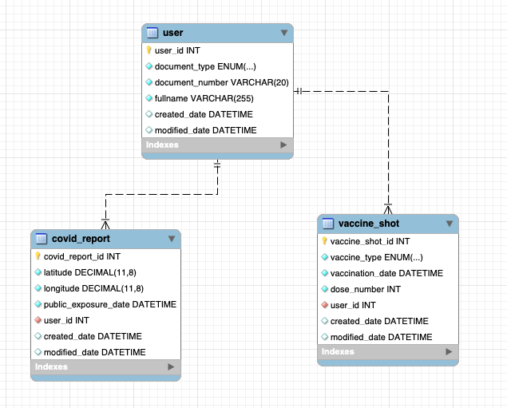

# The real COVID vaccine effectiveness

This project tries to measure the real effectiveness of the COVID vaccine.

For achieving that, we are going to start by tracking the COVID cases and their location.

## Team

| GitHub ID  | Position |
| ------------- | ------------- |
| [@nex3](https://github.com/nex3)  | Project Manager  |
| [@franciscovilchezv](https://github.com/franciscovilchezv)  | Developer  |
| [@Zanderz17] | Administrador de Base de Datos  |

## Database design

This is an initial proposal for the App's Database. Changes will likely be done in the future.



### Tabla  user

```
mysql> desc user;
+-----------------+-----------------------+------+-----+---------+----------------+
| Field           | Type                  | Null | Key | Default | Extra          |
+-----------------+-----------------------+------+-----+---------+----------------+
| user_id         | int                   | NO   | PRI | NULL    | auto_increment |
| document_type   | enum('ID','PASSPORT') | NO   |     | NULL    |                |
| document_number | varchar(20)           | NO   |     | NULL    |                |
| fullname        | varchar(255)          | NO   |     | NULL    |                |
| created_date    | datetime              | YES  |     | NULL    |                |
| modified_date   | datetime              | YES  |     | NULL    |                |
+-----------------+-----------------------+------+-----+---------+----------------+
6 rows in set (0.00 sec)
```

### Tabla vaccine_shot

`user_id` es un foerign key proveniente de la tabla `user`

```
mysql> desc vaccine_shot;
+------------------+------------------------------------------------+------+-----+---------+----------------+
| Field            | Type                                           | Null | Key | Default | Extra          |
+------------------+------------------------------------------------+------+-----+---------+----------------+
| vaccine_shot_id  | int                                            | NO   | PRI | NULL    | auto_increment |
| vaccine_type     | enum('PFIZER','J&J','SINOPHARM','ASTRAZENECA') | NO   |     | NULL    |                |
| vaccination_date | datetime                                       | NO   |     | NULL    |                |
| dose_number      | int                                            | NO   |     | NULL    |                |
| user_id          | int                                            | NO   | MUL | NULL    |                |
| created_date     | datetime                                       | YES  |     | NULL    |                |
| modified_date    | datetime                                       | YES  |     | NULL    |                |
+------------------+------------------------------------------------+------+-----+---------+----------------+
7 rows in set (0.00 sec)
```

### Tabla covid_report

`user_id` es un foerign key proveniente de la tabla `user`

```
mysql> desc covid_report;
+----------------------+---------------+------+-----+---------+----------------+
| Field                | Type          | Null | Key | Default | Extra          |
+----------------------+---------------+------+-----+---------+----------------+
| covid_report_id      | int           | NO   | PRI | NULL    | auto_increment |
| latitude             | decimal(11,8) | NO   |     | NULL    |                |
| longitude            | decimal(11,8) | NO   |     | NULL    |                |
| public_exposure_date | datetime      | NO   |     | NULL    |                |
| user_id              | int           | NO   | MUL | NULL    |                |
| created_date         | datetime      | YES  |     | NULL    |                |
| modified_date        | datetime      | YES  |     | NULL    |                |
+----------------------+---------------+------+-----+---------+----------------+
7 rows in set (0.00 sec)
```

## Additional information

*Project created for [academical purposes](https://github.com/franciscovilchezv/platform-based-development/blob/main/Quizzes/PC1/README.md).*
